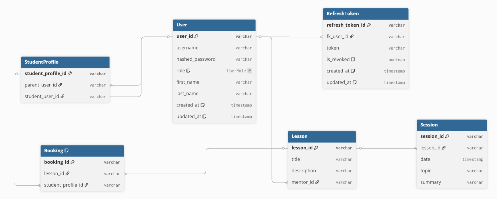

# Mentora backend



A Node.js/TypeScript REST API backend for the Mentora platform connecting mentors, parents, and students through lessons, sessions, and bookings. Built with Express, Prisma ORM, PostgreSQL, and Groq for LLM interactions.

---

## Tech Stack

- **Runtime**: Node.js + TypeScript
- **Framework**: Express
- **ORM**: Prisma
- **Database**: PostgreSQL
- **LLM Provider**: Groq
- **Auth**: JWT (Access + Refresh tokens)

---

## Getting Started

### 1. Install dependencies

```bash
npm install
```

### 2. Generate Prisma client (if not already generated with install)

```bash
npx prisma generate
```

### 3. Configure environment variables

Copy `.env.example` to `.env` and fill in the values:

```env
PORT=
DATABASE_URL=
ACCESS_TOKEN_SECRET=
REFRESH_SECRET=
GROQ_API_KEY=
```

| Variable | Description |
|---|---|
| `PORT` | Port the Express server listens on |
| `DATABASE_URL` | PostgreSQL connection string |
| `ACCESS_TOKEN_SECRET` | Secret for signing JWT access tokens (use a strong random string) |
| `REFRESH_SECRET` | Secret for signing JWT refresh tokens (use a strong random string) |
| `GROQ_API_KEY` | API key from [Groq](https://console.groq.com) |

> **Note:** The server will not start if any required environment variable is missing.

### 4. Start the server

```bash
npm run dev
```

Entry point: `src/index.ts`

---

## Project Structure

```
📦src
 ┣ 📂controllers     # Request handling and business logic
 ┃ ┣ auth.controller.ts
 ┃ ┣ bookings.controller.ts
 ┃ ┣ lessons.controller.ts
 ┃ ┣ llm.controller.ts
 ┃ ┣ sessions.controller.ts
 ┃ ┗ students.controller.ts
 ┣ 📂lib             # Shared library instances (DB client, OpenAI/Groq client)
 ┃ ┣ db.ts
 ┃ ┗ openai.ts
 ┣ 📂middleware      # Express middleware
 ┃ ┣ auth.middleware.ts
 ┃ ┗ ratelimiter.middleware.ts
 ┣ 📂routes          # Route definitions and TypeScript interfaces
 ┃ ┣ 📂interface
 ┃ ┃ ┣ auth.interface.ts
 ┃ ┃ ┣ booking.interface.ts
 ┃ ┃ ┣ lessons.interface.ts
 ┃ ┃ ┣ session.interface.ts
 ┃ ┃ ┗ users.interface.ts
 ┃ ┣ auth.routes.ts
 ┃ ┣ bookings.router.ts
 ┃ ┣ general.routes.ts
 ┃ ┣ index.ts
 ┃ ┣ lessons.router.ts
 ┃ ┣ llm.router.ts
 ┃ ┗ students.router.ts
 ┣ 📂service         # Database operations via Prisma
 ┃ ┣ bookings.service.ts
 ┃ ┣ lesson.service.ts
 ┃ ┣ sessions.service.ts
 ┃ ┣ studentProfile.service.ts
 ┃ ┗ user.service.ts
 ┣ 📂utils           # Helpers, constants, and validation
 ┃ ┣ auth.util.ts
 ┃ ┣ constants.ts
 ┃ ┗ validations.util.ts
 ┗ index.ts          # Express app entry point
```

### Request Flow

```
Request -> Route -> Controller -> Service -> Prisma -> PostgreSQL
```

Each layer has a single responsibility: routes define endpoints, controllers handle logic and auth checks, and services perform database queries.

---

## Authentication

Authentication uses a dual-token JWT strategy.

| Token | Expiry | Purpose |
|---|---|---|
| Access Token | 60 minutes | Authorizes API requests |
| Refresh Token | 7 days | Issues new access tokens |

Protected routes require a valid Bearer token in the `Authorization` header:

```
Authorization: Bearer <access_token>
```

The `authenticate` middleware validates the token, extracts `userId` and `role` from the payload, and attaches them to `res.locals` for downstream use.

---

## Roles

The platform supports three user roles that control access to endpoints:

- **`mentor`** - Can create lessons and sessions
- **`parent`** - Can view lessons and manage bookings
- **`student`** - Restricted access; cannot view lessons directly

---

## Configuration Notes

### Disabling the LLM

If the Groq API is not available, you can disable the LLM routes in `src/index.ts`.

### Changing the LLM Model

To switch models or base URL, edit `src/lib/openai.ts` and visit `src/controllers/llm.controller.ts`.

### Database Schema

See `prisma/schema.prisma` for the full data model.

---

## API Overview

| Prefix | Router | Description |
|---|---|---|
| `/auth` | `auth.routes.ts` | Register, login, token refresh |
| `/lessons` | `lessons.router.ts` | Lesson CRUD, session management |
| `/bookings` | `bookings.router.ts` | Booking management |
| `/students` | `students.router.ts` | Student profiles |
| `/llm` | `llm.router.ts` | LLM chat interactions |

See `src/routes/index.ts` for the full route registration.

---
 
## API Documentation
 
Full API documentation is available in [`API_DOCUMENTATION.md`](./API_DOCUMENTATION.md), including request/response examples, field references, error codes, and a role permission table for every endpoint.
 
---
 
## Testing the API
 
A set of ready to run fetch scripts is available in the `/scripts` folder one file per endpoint. Open any script, fill in the variables at the top, and run it with `node`. See [`API_DOCUMENTATION.md`](./API_DOCUMENTATION.md) for details on each endpoint and example usage.
 